```{r setup, include=FALSE}
knitr::opts_chunk$set(echo = TRUE, fig.align = "center")
library(tidyverse)
library(caret)
library(glmnet)
library(e1071)
library(rpart)
library(randomForest)
library(gbm)
library(xgboost)
library(lime)
library(dslabs)
library(gridExtra)
library(kableExtra)
library(pROC)
img_path <- "figs/"
```

# Support Vector Machines
## Support Vector Machines
\Large
**Support vector machines** or **SVM**s are supervised learning models with associated learning algorithms that analyze data used for classification and regression analysis. 

The goal is to find a classifier from an optimized _decision boundary_ or _“separating hyperplane”_ between two classes.


\footnotesize
Material for this lecture was obtained and adapted from: 

* [https://www.datacamp.com/community/tutorials/support-vector-machines-r](https://www.datacamp.com/community/tutorials/support-vector-machines-r) 
* [_The Elements of Statistical Learning_, Hastie, et al., Springer](https://hastie.su.domains/Papers/ESLII.pdf)
* [https://www.geeksforgeeks.org/classifying-data-using-support-vector-machinessvms-in-r/amp/](https://www.geeksforgeeks.org/classifying-data-using-support-vector-machinessvms-in-r/amp/)

## Support Vector Machines--Linear Data
Let’s imagine we have two tags: _red_ and _blue_, and our data has two features: $x$ and $y$. We can plot our training data on a plane:

\center
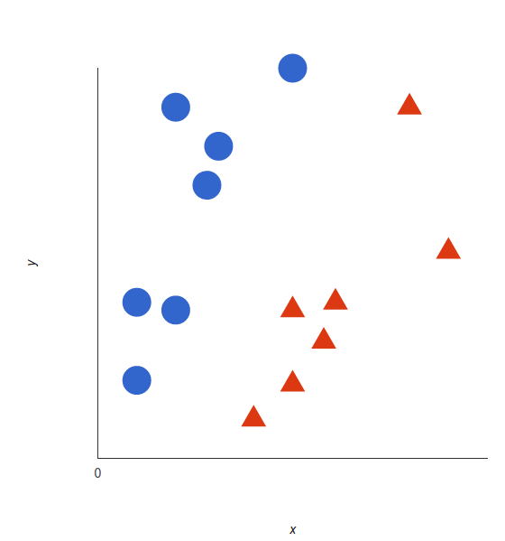{width=35%}

## Support Vector Machines
An **SVM** identifies the **decision boundary** or **hyperplane** (two dimensions: line) that best separates the tags:

\center
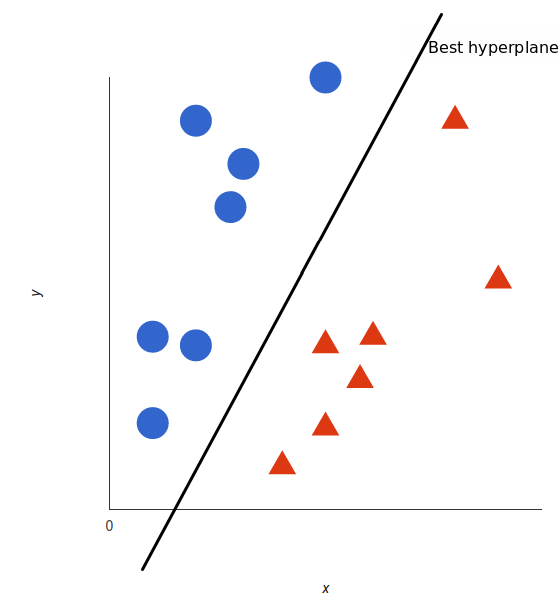{width=35%}


## Support Vector Machines
But, what exactly is the best hyperplane? For SVM, it’s the one that maximizes the margins from the data from both tags:
\center
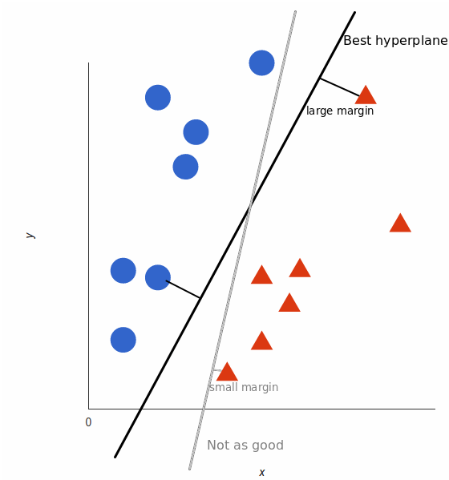{width=35%}

## Support Vector Machines in R
\Large
First generate some data in 2 dimensions, and make them a little separated:

```{r,eval=F, out.width="60%",fig.align='center'}
set.seed(10111)
x = matrix(rnorm(40), 20, 2)
y = rep(c(-1, 1), c(10, 10))
x[y == 1,] = x[y == 1,] + 1
plot(x, col = y + 3, pch = 19)
```

## Support Vector Machines in R

```{r,echo=F, out.width="70%",fig.align='center'}
set.seed(10111)
x = matrix(rnorm(40), 20, 2)
y = rep(c(-1, 1), c(10, 10))
x[y == 1,] = x[y == 1,] + 1
plot(x, col = y + 3, pch = 19)
```


## Support Vector Machines in R
We will use the **e1071** package which contains the svm function and make a dataframe of the data, turning $y$ into a factor variable.

\scriptsize
```{r,out.width="60%",fig.align='center'}
library(e1071)
dat = data.frame(x, y = as.factor(y))
svmfit = svm(y ~ ., data = dat, kernel = "linear", cost = 10, scale = FALSE)
print(svmfit)
```

<!--Printing the svmfit gives its summary. You can see that the number of support vectors is 6 - they are the points that are close to the boundary or on the wrong side of the boundary.-->

## Support Vector Machines in R
Or plotting it more cleanly:
```{r,include=F,echo=F}
make.grid = function(x, n = 75) {
  grange = apply(x, 2, range)
  x1 = seq(from = grange[1,1], to = grange[2,1], length = n)
  x2 = seq(from = grange[1,2], to = grange[2,2], length = n)
  expand.grid(X1 = x1, X2 = x2)
}
xgrid = make.grid(x)
```

```{r,echo=F,out.width="65%",fig.align='center'}
ygrid = predict(svmfit, xgrid)
plot(xgrid, col = c("red","blue")[as.numeric(ygrid)], pch = 20, cex = .2)
points(x, col = y + 3, pch = 19)
points(x[svmfit$index,], pch = 5, cex = 2)
```


## Support Vector Machines in R

```{r, include=FALSE}
beta  <- drop(t(svmfit$coefs) %*% x[svmfit$index, ])
beta0 <- svmfit$rho
```

Now plotting the lines on the graph:
\footnotesize
```{r,out.width="65%",fig.align='center' ,echo=F}
plot(xgrid, col = c("red", "blue")[as.numeric(ygrid)], pch = 20, cex = .2)
points(x, col = y + 3, pch = 19)
points(x[svmfit$index,], pch = 5, cex = 2)
abline(beta0 / beta[2], -beta[1] / beta[2])
abline((beta0 - 1) / beta[2], -beta[1] / beta[2], lty = 2)
abline((beta0 + 1) / beta[2], -beta[1] / beta[2], lty = 2)
```

## Support Vector Machines--Non-Linear Data
The prior examples were easy because the data were linearly separable. Often things aren’t that simple. Look at this case:

\center
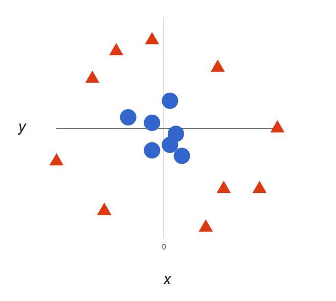{width=40%}

## Support Vector Machines
Here we will add a third dimension: z = x2 + y2 (you’ll notice that’s the equation for a circle!), and plot x and z. 

\center
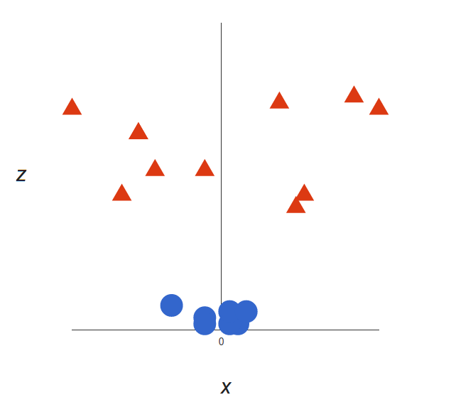{width=40%}

## Support Vector Machines
What can SVM do with this? Let’s see:

\center
 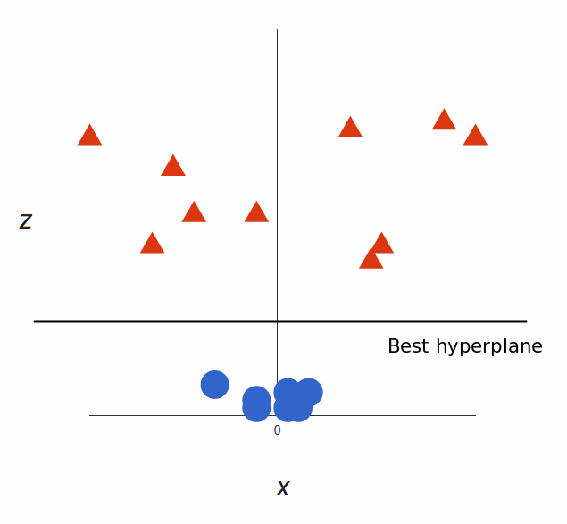{width=40%}

\raggedright
That’s great! Note that since we are in three dimensions now, the hyperplane is a plane parallel to the $x$ axis at a certain $z$ (let’s say $z$=1).

## Support Vector Machines
What’s left is mapping it back to two dimensions:

\hfil 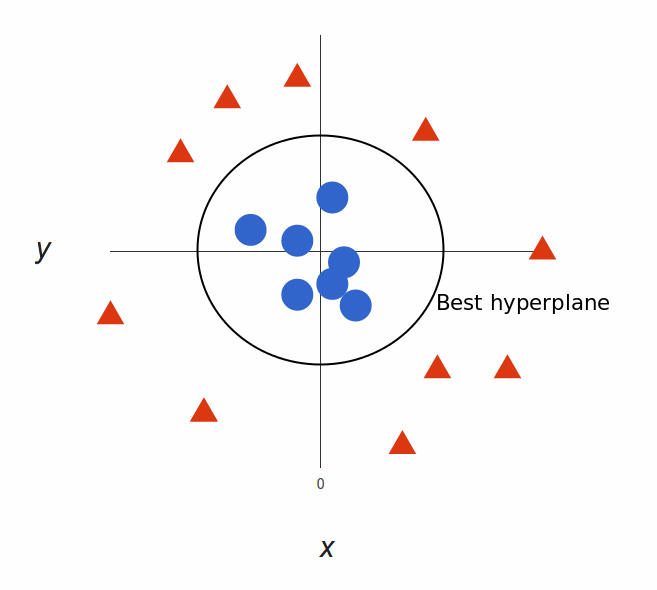{width=50%} \hfil

And there we go! Our decision boundary is a circumference of radius 1, which separates both tags using SVM.

## The "Kernel Trick"
\Large
Transformations are computationally expensive, but SVM doesn’t need the actual vectors, it only needs the dot products.


We can tell SVM to do its thing using the new dot product—we call this a **kernel function.**

## The "Kernel Trick"
\Large
This often called the _“kernel trick”_, which enlarges the feature space for a non-linear boundary between the classes.

Common types of kernels: _linear_, _polynomial_, and _radial basis_ kernels. 

Simply, these kernels transform our data to pass a linear hyperplane and thus classify our data.

## Support Vector Machines in R: Non-linear SVM
Now let's apply a non-linear (polynomial) SVM to our prior simulated dataset. 
\scriptsize
```{r,out.width="60%",fig.align='center'}
dat = data.frame(x, y = as.factor(y))
svmfit = svm(y ~ ., data = dat, kernel = "polynomial", cost = 10, scale = FALSE)
print(svmfit)
```


## Support Vector Machines in R: Non-linear SVM
Plotting the result:
```{r,out.width="65%",fig.align='center', echo=F}
ygrid = predict(svmfit, xgrid)
plot(xgrid, col = c("red","blue")[as.numeric(ygrid)], pch = 20, cex = .2)
points(x, col = y + 3, pch = 19)
points(x[svmfit$index,], pch = 5, cex = 2)
```

## Support Vector Machines in R: Non-linear SVM
\Large
Here is a more complex example from _Elements of Statistical Learning_, where the decision boundary needs to be non-linear and there is no clear separation. 
\scriptsize
```{r}
#download.file(
#  "http://www-stat.stanford.edu/~tibs/ElemStatLearn/datasets/ESL.mixture.rda", 
#  destfile='ESL.mixture.rda')
rm(x,y)
load(file = "ESL.mixture.rda")
attach(ESL.mixture)
names(ESL.mixture)
```

## Support Vector Machines in R: Non-linear SVM
Plotting the data:
```{r, echo=F, out.width="60%", fig.height=4.5, fig.width=6, fig.align='center'}
plot(x, col = y + 1)
```


## Support Vector Machines in R: Non-linear SVM
Now make a data frame with the response $y$, and turn that into a factor. We will fit an SVM with radial kernel.
\scriptsize
```{r}
dat = data.frame(y = factor(y), x)
fit = svm(factor(y) ~ ., data = dat, scale = FALSE, kernel = "radial", cost = 5)
print(fit)
```


## Support Vector Machines in R: Non-linear SVM

It's time to create a grid and  predictions. We use `expand.grid` to create the grid, predict each of the values on the grid, and plot them:
\scriptsize
```{r, echo=F, out.width="60%", fig.height=4.5, fig.width=6, fig.align='center'}
xgrid = expand.grid(X1 = px1, X2 = px2)
ygrid = predict(fit, xgrid)
plot(xgrid, col = as.numeric(ygrid), pch = 20, cex = .2)
points(x, col = y + 1, pch = 19)
```

## Support Vector Machines in R: Non-linear SVM

Plotting with a contour:
```{r, out.width="65%", fig.height=4.5, fig.width=6, fig.align='center', echo=F}
func = predict(fit, xgrid, decision.values = TRUE)
func = attributes(func)$decision

xgrid = expand.grid(X1 = px1, X2 = px2)
ygrid = predict(fit, xgrid)
plot(xgrid, col = as.numeric(ygrid), pch = 20, cex = .2)
points(x, col = y + 1, pch = 19)

contour(px1, px2, matrix(func, 69, 99), level = 0, add = TRUE, lwd=2)
```

## Advantages and Disadvantages of SVMs
\Large
**Advantages:**

* **High Dimensionality:** SVM is an effective tool in spaces where dimensionality is large.
* **Memory Efficiency:** Only a subset of the training points are used, so just these points need to be stored in memory.
* **Versatility:** Class separation is often highly non-linear. The ability to apply new kernels allows flexibility for the decision boundaries.

## Advantages and Disadvantages of SVMs
\Large
**Disadvantages:**

* **Kernel Selection:** SVMs are very sensitive to the choice of the kernel parameters. 
* **High dimensionality:** When the number of features for each object exceeds the number of training data samples, SVMs can perform poorly.
* **Non-Probabilistic:** The classifier works by placing objects above/below a classifying hyperplane, there is no direct probabilistic interpretation.

## SVM Nanostring

Remember the PCA dimension reduction of the TB Nanostring dataset. The points are colored based on TB status.

```{r, echo=F, out.width="50%", fig.height=4.5, fig.width=6}
TBnanostring <- readRDS("TBnanostring.rds")

pca_out <- prcomp(TBnanostring[,-1])
  
pca_reduction <- as.data.frame(pca_out$x)
pca_reduction$Condition <- as.factor(TBnanostring$TB_Status)

pca_reduction %>% ggplot(aes(x=PC1, y=PC2, color=Condition)) + 
    geom_point() + xlab("PC 1") + ylab("PC 2") + 
    theme(plot.title = element_text(hjust = 0.5)) + ggtitle("PCA Plot")
```


## SVM Nanostring
Now try an SVM on the PCs of the Nanostring data:
\scriptsize
```{r}
# use only the first 10 PCs
dat = data.frame(y = pca_reduction$Condition, pca_reduction[,1:2])
fit = svm(y ~ ., data = dat, scale = FALSE, kernel = "linear", cost = 10)
print(fit)
```

## SVM Nanostring
We can evaluate the predictor with a `Confusion matrix`:
\tiny
```{r}
library(caret)
confusionMatrix(dat$y,predict(fit,dat))
```


## SVM Nanostring

```{r,echo=F,out.width="75%", fig.height=4.5, fig.width=6}
make.grid = function(x, n = 75) {
  grange = apply(x, 2, range)
  x1 = seq(from = grange[1,1], to = grange[2,1], length = n)
  x2 = seq(from = grange[1,2], to = grange[2,2], length = n)
  tmp = expand.grid(X1 = x1, X2 = x2)
}
xgrid = make.grid(dat[,-1])
colnames(xgrid)<-colnames(dat[,-1])

ygrid = predict(fit, xgrid)
plot(xgrid, col = c("red","blue")[as.numeric(ygrid)], pch = 20, cex = .2)
points(dat[,2:3], col = dat[,1] , pch = 19)
```


# Regularization: Ridge, LASSO, and Elastic Net

## Introduction to Regression
\Large
The most common form of regression analysis is **linear regression**, in which one finds the line (or a more complex linear combination) that most closely fits the data according to a specific mathematical criterion.

## Introduction to Regression
\Large
In your math classes, you used the following model for a line, where $m$ represents the slope and $b$ represents the $y$-intercept: 
$$y=mx+b.$$

In statistics, we use a slightly different formulation and notation: 
$$y_i=\beta_0+x_i\beta_1 ,$$
which describes a line with slope $\beta_1$ and $y$-intercept $\beta_0$, and the $y_i$ and $x_i$ represent the observed points from your dataset. 

## Introduction to Regression
\center
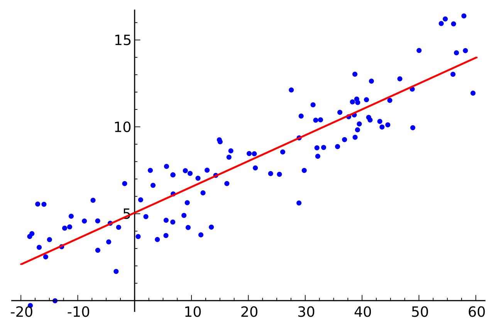{height='70%'}


## Introduction to Regression
\Large
Formal Definition: suppose we observe $n$ data pairs and call them 
$${(x_i, y_i), i = 1, ..., n}.$$ 

We can describe the underlying relationship between $y_i$ and $x_i$ involving this error term $\epsilon_i$ by
$$y_i=\beta_0+x_i\beta_1 +\epsilon_i.$$

We call the deviations of the data from the line the **errors**. It is also important to note that the true underlying parameters $\beta_0$ and $\beta_1$ are not observed, but must be _estimated_ using the data.


## Introduction to Regression
\Large
The goal is to find estimated values $\hat\beta_0$ and $\hat\beta_1$ for the parameters $\beta_0$ and $\beta_1$ which would provide the "best fit" in some sense for the data points. 

Here, the "best fit" will be understood as in the __least-squares__ approach: a line that minimizes the sum of squared residuals 
$$\min_{\beta_0,\beta_1}Q(\beta_0,\beta_1) =  \underset{\beta_0,\beta_1}\inf\left\{\sum_{i=1}^n(y_i-\beta_0-x_i\beta_1)^2\right\}=\inf_{\beta_0,\beta_1}\sum_{i=1}^n \epsilon_i^2.$$

## Ridge regression
\Large
Ridge regression **regularizes** (shrinks) coefficients by imposing a penalty on 
their size. The ridge coefficients minimize a penalized sum of squared error: 
$$\hat\beta^{ridge}=\underset{\beta}\inf\left\{\sum_{i=1}^{N}(y_i-\sum_{j=1}^{p}x_{ij}\beta_j)^2+\lambda\sum_{j=1}^{p}\beta_j^2\right\},$$
where $\lambda\ge 0$ is a parameter that controls the shrinkage. The larger the value of $\lambda$ the more shrinkage  (towards 0). 


## Lasso regression
\Large
Lasso (Least Absolute Shrinkage and Selection Operator) regression also **regularizes** coefficients by imposing a penalty on 
their size, but it uses an **L1** penalty. The lasso coefficients minimize the following cost function: 
$$\hat\beta^{lasso}=\underset{\beta}\inf\left\{\sum_{i=1}^{N}(y_i-\sum_{j=1}^{p}x_{ij}\beta_j)^2+\alpha\sum_{j=1}^{p}|\beta_j|\right\},$$
where $\alpha\ge 0$ is a parameter that controls the shrinkage. The larger the value of $\alpha$ the more shrinkage  (towards 0). 

## Lasso vs Ridge regression
\center
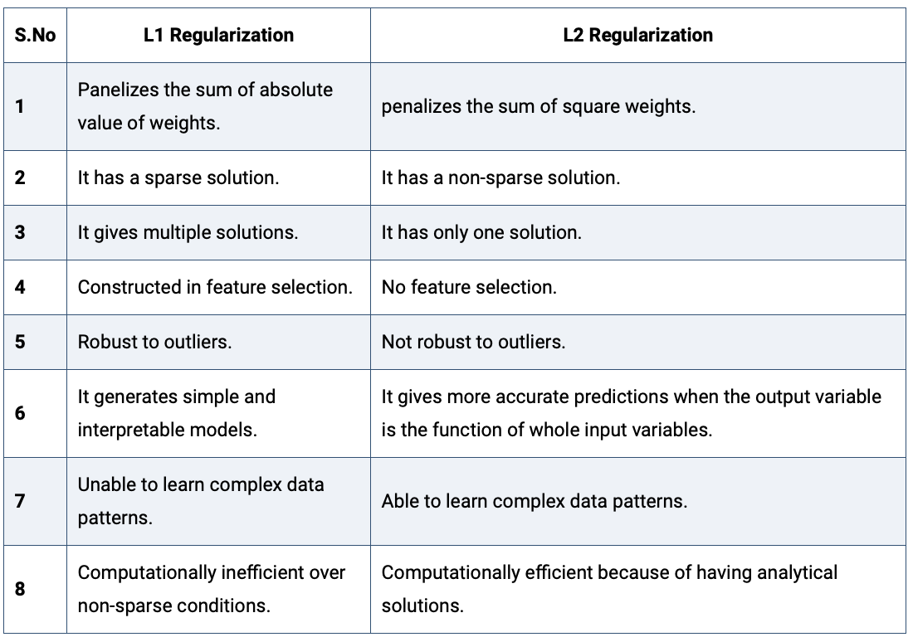{width=60%}

\tiny
(https://www.analyticssteps.com/blogs/l2-and-l1-regularization-machine-learning)


## Elastic net regularization
\Large
Which should I choose? Ridge or Lasso? Well, why do I have to choose! Instead use the **Elastic Net** that minimizes: 
$$\hat\beta^{elastic\ net}=\underset{\beta}\inf\left\{\sum_{i=1}^{N}(y_i-\sum_{j=1}^{p}x_{ij}\beta_j)^2+\alpha\sum_{j=1}^{p}|\beta_j|+\lambda\sum_{j=1}^{p}\beta_j^2\right\},$$
for some $\alpha\ge 0$ and $\lambda\ge 0$.

The quadratic penalty term makes the loss function strongly convex, and it therefore has a unique minimum. The elastic net method includes OLS, Lasso, and Ridge regression by setting either $\alpha=0$, $\lambda=0$, or both to 0. 


## Regression Regularization in R: glmnet
\Large
We can use the **glmnet** package to apply regularization in R: 

```{r, eval=F}
install.packages("glmnet")
```

## Regression Regularization in R: glmnet
Using the quick start example from the package:

```{r}
library(glmnet)
data(QuickStartExample)
x <- QuickStartExample$x
y <- QuickStartExample$y
```

## Example: Logistic Regression Elastic Net
\Large
Logistic regression is a widely-used model when the response is binary. Suppose the response variable $y$ takes values \{0,1\}. We model
$$P(y=1|{\bf X})=\frac{e^{{\bf X\beta}}}{1+e^{X\beta}},$$
which can be written in the following form:
$$\log\frac{P(y=1|{\bf X})}{P(y=0|{\bf X})}={\bf X}\beta,$$
the so-called “logistic” or log-odds transformation.

## Example: Logistic Regression Elastic Net
\Large
Using the example dataset from the glmnet package:

```{r}
library(glmnet)
data(BinomialExample)
x <- BinomialExample$x
y <- BinomialExample$y
```

## Example: Logistic Regression Elastic Net
\Large
Set family option to “binomial” in the glmnet function:
```{r}
fit <- glmnet(x, y, family = "binomial")
```

The code below uses misclassification error as the criterion for 10-fold cross-validation:
```{r }
cvfit <- cv.glmnet(x, y, family = "binomial", 
                   type.measure = "class")
```

## Example: Logistic Regression Elastic Net
Now we can plot the cross-validation results and find the 'best' $\lambda_{min}$:
```{r fig.height = 4, fig.width = 10, out.width="100%", fig.align="center"}
plot(cvfit)
cvfit$lambda.min
```

## Example: Logistic Regression Elastic Net
\tiny
```{r }
coef(cvfit, s = "lambda.min")
```

# Decision Trees
## Motivating example: olive oil
To motivate this section, we will use a new dataset that includes the breakdown of the composition of olive oil into 8 fatty acids:
```{r}
library(tidyverse)
library(dslabs)
data("olive")
olive <- select(olive, -area) #remove the `area` column--don't use it
names(olive) 
```

## Motivating example: olive oil
Here is a quick look at the data:
```{r}
olive %>% head() %>% 
  knitr::kable() %>% kable_styling(font_size =7)
```

## Motivating example: olive oil
\Large
We will try to predict the region using the fatty acid composition values as predictors.

```{r}
table(olive$region)
```

## Motivating example: olive oil
A bit of data exploration reveals that the regions should be separable: note that eicosenoic is only in Southern Italy and linoleic separates Northern Italy from Sardinia.

```{r olive-eda, fig.height=3, fig.width=6, echo=FALSE,out.width="80%"}
olive %>% gather(fatty_acid, percentage, -region) %>%
  ggplot(aes(region, percentage, fill = region)) +
  geom_boxplot() +
  facet_wrap(~fatty_acid, scales = "free", ncol = 4) +
  theme(axis.text.x = element_blank(), legend.position="bottom")
```

## Motivating example: olive oil
This implies that we should be able to build an algorithm that predicts perfectly! Let's try plotting the values for eicosenoic and linoleic.

```{r olive-two-predictors, echo=FALSE,out.width="75%", fig.align='center',fig.height=3,fig.width=6}
olive %>% 
  ggplot(aes(eicosenoic, linoleic, color = region)) + 
  geom_point() +
  geom_vline(xintercept = 0.065, lty = 2) + 
  geom_segment(x = -0.2, y = 10.54, xend = 0.065, yend = 10.54, 
               color = "black", lty = 2)
```

## Motivating example: olive oil
Let's define a **decision rule**: If eicosenoic is larger than 0.065, predict Southern Italy. If not, then if linoleic is larger than $10.535$, predict Sardinia, otherwise predict Northern Italy. We can draw this decision tree:

```{r olive-tree, echo=FALSE, warning=FALSE, message=FALSE, fig.height=3.5,fig.width=7, out.width="100%", fig.align="center"}
library(caret)
library(rpart)
train_rpart <- train(region ~ ., method = "rpart", data = olive)
plot(train_rpart$finalModel, margin = 0.1)
text(train_rpart$finalModel, cex = 0.75)
```

## Decision Trees
**Decision trees** like this are often used in practice. For example, to evaluate a person's risk of poor outcome after a heart attack, doctors may use:

\center
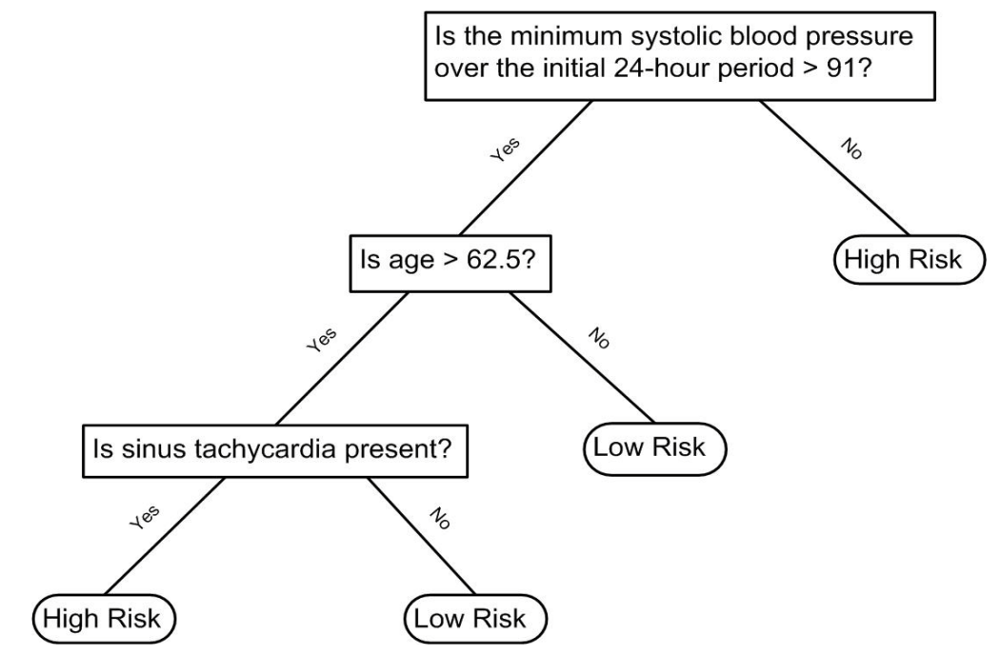{width=50%}

\scriptsize
([Source: Walton 2010 Informal Logic, Vol. 30, No. 2, pp. 159-184](https://papers.ssrn.com/sol3/Delivery.cfm/SSRN_ID1759289_code1486039.pdf?abstractid=1759289&mirid=1&type=2).)

## Decision Trees
\Large
A tree is a flow chart of yes or no questions. We define an algorithm that creates trees with predictions at the ends, referred to as __nodes__.

Regression and decision trees, or sometimes called **Classification and Regression Trees (CART)**, predict an outcome $Y$ by partitioning the predictors ${\bf X}$.

## Classification (decision) trees

\Large
**Classification trees** predict a **categorical** outcome.

\vskip .2in

The tree splits the predictors into partitions, then:

\vskip .1in
\large

- Each partition predicts the **most common class** in it
- Splits are chosen to make partitions as **pure** as possible, measured by
  the **Gini index** or **entropy**

## Classification (decision) trees
Lets look at how a classification tree performs on the following dataset:
```{r, echo=FALSE, out.width="80%", warning=FALSE, message=FALSE, fig.height=4, fig.width=8, fig.align='center'}
data("mnist_27")

plot_cond_prob <- function(p_hat=NULL){
  tmp <- mnist_27$true_p
  if(!is.null(p_hat)){
    tmp <- mutate(tmp, p=p_hat)
  }
  tmp %>% ggplot(aes(x_1, x_2, z=p, fill=p)) +
  geom_raster(show.legend = FALSE) +
  scale_fill_gradientn(colors=c("#F8766D","white","#00BFC4")) +
  stat_contour(breaks=c(0.5),color="black")
}

p1 <- mnist_27$train %>% 
  ggplot(aes(x_1,x_2,col=y)) + geom_point() +
  ggtitle("Scatterplot of the data")

p2 <- plot_cond_prob() + ggtitle("True conditional probability")

grid.arrange(p1, p2, nrow=1)

```

## Classification (decision) trees

```{r, include=FALSE}
train_rpart <- train(y ~ ., method = "rpart", data = mnist_27$train,
                     tuneGrid = data.frame(cp = seq(0.0, 0.1, len = 30)))
```

The accuracy achieved by this approach is better than what we got with regression, but is not as good as what we achieved with kernel methods:

```{r}
y_hat <- predict(train_rpart, mnist_27$test)
confusionMatrix(y_hat, mnist_27$test$y)$overall["Accuracy"]
```

## Classification (decision) trees
The conditional probability shows us the limitations of classification trees:

```{r rf-cond-prob, echo=FALSE, out.width="80%", warning=FALSE, message=FALSE, fig.height=4, fig.width=8, fig.align='center'}
library(gridExtra)
p1 <- plot_cond_prob() + ggtitle("True conditional probability")

p2 <- plot_cond_prob(predict(train_rpart, newdata = mnist_27$true_p, type = "prob")[,2]) +
  ggtitle("Decision Tree")

grid.arrange(p2, p1, nrow=1)
```

## Classification (decision) trees

Classification trees have certain advantages that make them very useful. 

* They are highly interpretable, even more so than linear models. 
* They are easy to visualize (if small enough).  
* They can model human decision processes and don't require use of dummy predictors for categorical variables. 

On the other hand: 

* The approach via recursive partitioning can easily over-train and is therefore a bit harder to train than, for example, linear regression or kNN. 
* In terms of accuracy, it is rarely the best performing method since it is not very flexible and is highly unstable to changes in training data. 


## The Problem: High Variance and Instability

\Large
A major drawback of a single decision tree is its **high variance** and **instability**. Small changes in the training data can lead to a completely different tree structure.

* **High Variance**: Because the tree structure is based on local optimal splits, a slight perturbation in the data can drastically change the first split, cascading errors throughout the entire tree.
* **Instability**: A single tree is not robust. If you fit two trees on two slightly different subsets of the data (e.g., train/test splits), they will likely produce very different decision boundaries.

# Ensembles: Bagging and Boosting
##  Ensemble Methods: Bagging vs. Boosting

\Large
**Ensemble methods** combine the predictions of multiple individual models (often called **weak learners**, like decision trees) to create a single, highly accurate predictor.

The two main strategies for building ensembles are:

\normalsize
\begin{itemize}
    \item \textbf{Bagging (Bootstrap Aggregation)}: A {\it parallel} method where models are built independently and then averaged/combined. Used in \textbf{Random Forests}.
    \item \textbf{Boosting}: A {\it sequential} method where models are built iteratively, with each new model focusing on correcting the errors of the previous ones. Used in \textbf{XGBoost} (introduced soon).
\end{itemize}


## Bagging (Bootstrap Aggregation)

\Large
Bagging is a technique designed primarily to **reduce variance** in high-variance models, such as deep decision trees.

\small
\begin{enumerate}
    \item \textbf{Parallelism}: $B$ independent models are trained simultaneously.
    \item \textbf{Bootstrap Sampling}: Each model is trained on a unique {\it bootstrap sample} (sampling with replacement) of the original training data. This ensures the individual trees are diverse (random).
    \item \textbf{Final Prediction}: The predictions from all $B$ models are combined by:
    \begin{itemize}
        \item \textbf{Averaging} (for regression, e.g., Random Forest).
        \item \textbf{Majority Vote} (for classification, e.g., Random Forest).
    \end{itemize}
\end{enumerate}

\normalsize
The final averaged model has a significantly lower variance than any single tree, but the bias remains roughly the same.


## Boosting (Sequential Error Correction)

\Large
Boosting is an iterative technique designed primarily to *reduce bias* and create a single strong learner from a sequence of weak learners.

\small
\begin{enumerate}
    \item \textbf{Sequential Dependence}: Models are trained {\it one after the other}.
    \item \textbf{Error Focus}: Each subsequent model is trained to predict the {\it residuals} (the errors) of the combined ensemble created up to that point.
    \item \textbf{Weighted Combination}: New models are added to the ensemble using a small {\it learning rate ($\eta$)} to ensure the model learns slowly and prevents dramatic overfitting.
\end{enumerate}

\normalsize
Boosting can achieve very high predictive accuracy but requires careful tuning to avoid overfitting the training data, as seen with the complexity parameters in XGBoost.

## Ensemble Methods: Bagging vs. Boosting
\center
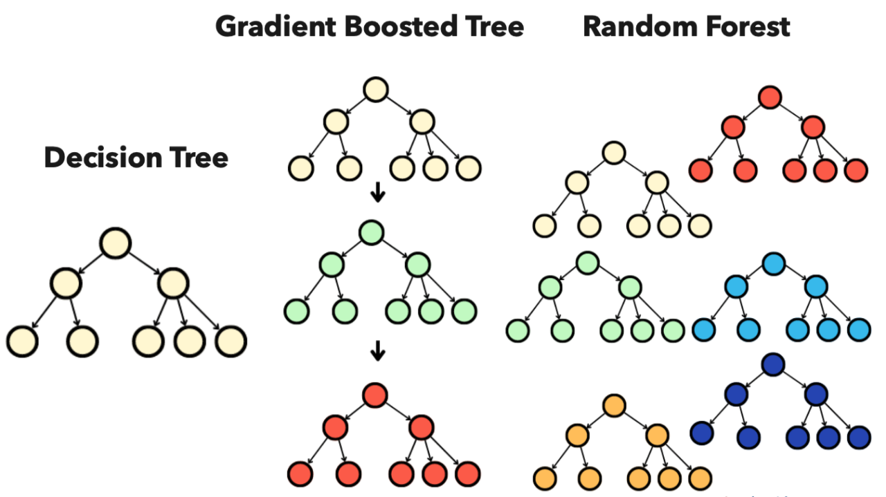{width="80%"}


# Random Forests
## Random forests
\Large
\Large
**Random forests** address the shortcomings of decision trees: they improve
prediction performance and reduce instability by **averaging** many trees.

\vskip .2in

The name says how it works -- the **bootstrap** makes the individual trees
randomly different, and the combination of those trees is the **forest**.

## Random forests

```{r, include=FALSE}
train_rf <- randomForest(y ~ ., data = mnist_27$train)
```

Here is what the conditional probabilities look like:

```{r cond-prob-rf, echo = FALSE, out.width="80%", warning=FALSE, message=FALSE, fig.height=4, fig.width=8, fig.align='center'}
p1 <- plot_cond_prob() + ggtitle("True conditional probability")

p2 <- plot_cond_prob(predict(train_rf, newdata = mnist_27$true_p, type = "prob")[,2]) +
  ggtitle("Random Forest")

grid.arrange(p2, p1, nrow=1)
```

## TB Nanostring Example

```{r, include=FALSE}
set.seed(0)
TBnanostring <- readRDS("TBnanostring.rds")
TBnanostring[[1]] <- as.factor(TBnanostring[[1]])
colnames(TBnanostring)[1] <- "TB_Status"
y <- TBnanostring$TB_Status
train_index <- createDataPartition(y, p = 0.7, list = FALSE)
train_data  <- TBnanostring[train_index, ]
test_data   <- TBnanostring[-train_index, ]
```
```{r}
ctrl_cv <- trainControl(method = "repeatedcv", 
                        number = 5, repeats = 3,
                        classProbs = TRUE, 
                        summaryFunction = twoClassSummary,
                        savePredictions = "final", 
                        verboseIter = FALSE)
```

## TB Nanostring Example
\scriptsize
```{r}
set.seed(123)
rf_model <- train(TB_Status ~ ., data = train_data, 
  method = "rf", metric = "ROC", importance = TRUE,
  trControl = ctrl_cv)

# Print optimal hyperparameters found by CV
print(rf_model)
```

## TB Nanostring Example
\scriptsize
```{r}
rf_pred <- predict(rf_model, test_data)
confusionMatrix(rf_pred, test_data$TB_Status)
```

## TB Nanostring Example
Variable Importance:

```{r,out.width="30%", echo=T, warning=FALSE, message=FALSE, fig.height=4, fig.width=4, fig.align='center'}
rf_imp <- varImp(rf_model, scale = FALSE)
plot(rf_imp, top = 10, main = "Top 10 Important Genes (Random Forest)")
```

## TB Nanostring Example
```{r,out.width="40%", echo=F, warning=FALSE, message=FALSE, fig.height=4, fig.width=4, fig.align='center'}
rf_probs <- predict(rf_model, test_data, type = "prob")[, "TB"]
rf_roc <- roc(test_data$TB_Status, rf_probs, levels = rev(levels(test_data$TB_Status)))
#auc(rf_roc)
plot(rf_roc, main = paste("Random Forest ROC Curve (AUC =", round(auc(rf_roc), 3), ")"))
```

# Gradient Boosting
## Introducing Gradient Boosting Machines (GBMs)
\Large Gradient Boosting Machines (GBMs) is the general class of ensemble methods that utilizes the boosting principle.

\small \textbf{How it relates to Boosting and XGBoost:} 

\begin{itemize} 
  \item Boosting Foundation: GBMs use the sequential error correction strategy (Boosting), where new trees correct the mistakes of the previous ensemble. 
  \item Gradient Descent: The "Gradient" in GBM refers to the use of gradient descent—an optimization algorithm—to precisely identify the errors (residuals) and determine the ideal direction for the next tree to move in to minimize the model's overall loss function. 
  \item XGBoost is an Implementation: XGBoost is simply a modern, highly optimized, and regularized (L1/L2) implementation of the GBM algorithm. \end{itemize}


\normalsize GBMs are generally more complex to train than Random Forests but often achieve superior predictive accuracy by aggressively reducing model bias.


## Introducing Gradient Boosting Machines (GBMs)
\center
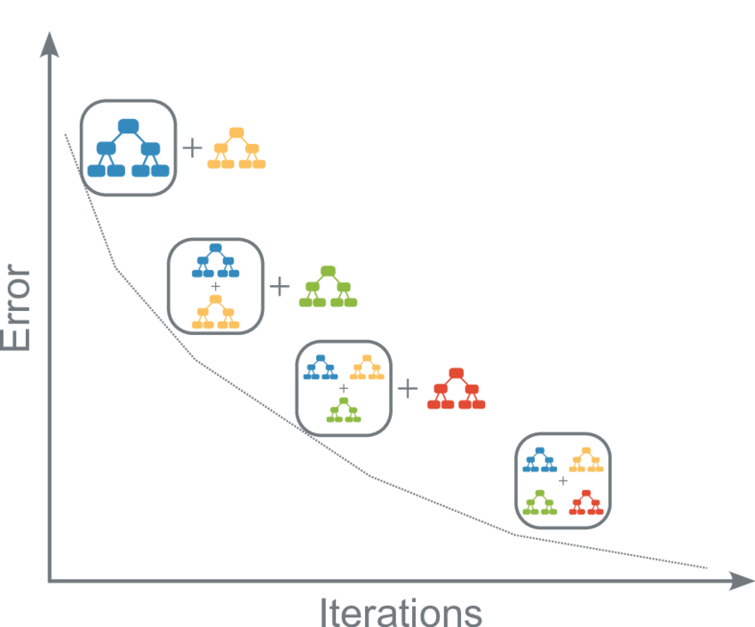{width=50%}

## GBM Example: Iris

```{r}
# Load the iris dataset and set up training control
data("iris")
set.seed(42) # Set seed for reproducibility

# 5-fold Cross-Validation
ctrl <- trainControl(method = "cv", number = 5)

# GBM Tuning Grid
gbmGrid <- expand.grid(n.trees = c(50, 100, 150),
                       interaction.depth = c(1, 3, 5),
                       shrinkage = c(0.1),
                       n.minobsinnode = 10)
```

## GBM Example: Iris
```{r}
# Train the GBM model
gbm_fit <- train(Species ~ ., data = iris,
  method = "gbm", trControl = ctrl,
  verbose = FALSE, tuneGrid = gbmGrid)

# Print best model results
print(gbm_fit)
```

## GBM Example: Iris
```{r,fig.height=5,fig.width=7, out.width="50%"}
plot(gbm_fit)
```

## GBM Example: Iris
\footnotesize
```{r}
gbm_predictions <- predict(gbm_fit, newdata = iris)
confusionMatrix(gbm_predictions, iris$Species)
```


## Extreme Gradient Boosting (XGBoost)

\Large
**XGBoost** (Extreme Gradient Boosting) is a highly optimized and scalable implementation of **Gradient Boosting Machines (GBMs)**. It builds upon the idea of decision trees and boosting.


## XGBoost: Iris Example

We call `xgboost` directly rather than through `caret`. The `caret` wrapper is a
thin shim over a fast-moving API, and it is the part that breaks between versions.

\scriptsize
```{r}
data("iris")
set.seed(42)

X      <- as.matrix(iris[, 1:4])
y      <- as.integer(iris$Species) - 1        # xgboost wants 0-based labels
dtrain <- xgb.DMatrix(data = X, label = y)

base_params <- list(objective   = "multi:softmax",
                    num_class   = 3,
                    eta         = 0.1,        # learning rate
                    eval_metric = "merror")   # classification error
```

## XGBoost: Iris Example

Tune tree depth by 5-fold cross-validation, letting early stopping choose
the number of boosting rounds:

\scriptsize
```{r}
tune <- do.call(rbind, lapply(c(1, 3, 5), function(d) {
  cv  <- xgb.cv(params = c(base_params, max_depth = d),
                data   = dtrain,
                nrounds = 150, nfold = 5,
                early_stopping_rounds = 20, verbose = 0)
  log <- as.data.frame(cv$evaluation_log)          # one row per round
  err <- log[[grep("^test_.*mean$", names(log))[1]]]
  i   <- which.min(err)
  data.frame(max_depth = d, nrounds = i, error = err[i])
}))
tune
```

## XGBoost: Iris Example
```{r, fig.height=4.2, fig.width=6, out.width="55%"}
plot(tune$max_depth, tune$error, type = "b", pch = 19,
     xlab = "max tree depth", ylab = "CV classification error")
```

## XGBoost: Iris Example

Refit at the best setting:

\scriptsize
```{r}
best <- tune[which.min(tune$error), ]

xgb_fit <- xgb.train(params  = c(base_params, max_depth = best$max_depth),
                     data    = dtrain,
                     nrounds = best$nrounds,
                     verbose = 0)
```

## XGBoost: Iris Example

Which features did the model actually use?

\scriptsize
```{r, fig.height=3.6, fig.width=6, out.width="60%"}
xgb.plot.importance(xgb.importance(model = xgb_fit))
```

## XGBoost: Iris Example
\footnotesize
```{r}
xgb_predictions <- factor(levels(iris$Species)[predict(xgb_fit, dtrain) + 1],
                          levels = levels(iris$Species))
confusionMatrix(xgb_predictions, iris$Species)
```


# Explainability: LIME and SHAP
## LIME: Local Interpretable Model-agnostic Explanations

\Large
**The idea:** take one prediction, jiggle the inputs a little, and watch how the
prediction moves. Fit a *simple* model to that local neighborhood -- its
coefficients are the explanation.

\vskip .15in
\large

- **Local**: tells you why *this* sample got *this* answer
- **Model-agnostic**: your model stays a black box
- Fast, but the explanation depends on how you jiggle

## LIME Example: GBM on Iris Data
\Large
```{r, message=F}
# install.packages("lime")
library(lime)
iris_features <- iris[, -5]

# Create a LIME explainer for the GBM model
gbm_explainer <- lime(
  x = iris_features,
  model = gbm_fit
)
```

## LIME Example: GBM on Iris Data
\Large
```{r}
# first 2 iris samples
samples_to_explain <- iris_features[c(1,51,101), ] 

gbm_lime_results <- explain(
  x = samples_to_explain,
  explainer = gbm_explainer,
  n_features = 4,
  n_labels = 1
)
```

## LIME Example: GBM on Iris Data
```{r,fig.height=4,fig.width=8, out.width="75%"}
plot_features(gbm_lime_results)
```

## SHAP: SHapley Additive exPlanations

\Large
**The idea:** borrowed from game theory. Treat the features as players on a team
whose payout is the prediction. A feature's SHAP value is its average
contribution across every possible team it could have joined.

\vskip .15in
\large

- **Additive**: the contributions sum to (this prediction $-$ average prediction)
- **Consistent**: a feature that matters more never scores lower
- **Local and global**: aggregate across samples for overall importance

## Which one, and when?

\vskip .1in
\small

| | **LIME** | **SHAP** |
| :--- | :--- | :--- |
| Asks | why did *this* prediction happen? | how much did each feature contribute? |
| Basis | a simple local surrogate model | game-theoretic credit assignment |
| Guarantees | none -- depends on the sampling | additive and consistent |
| Cost | fast | slow, but exact for trees (Tree SHAP) |
| Scope | local only | local *and* global |

\vskip .1in
\normalsize
Use LIME to interrogate a single surprising case. Use SHAP when you need the
attribution itself to be defensible.

## Hands-on practice

\Large
Everything in this session has a matching workshop you can work through at your own pace:

\vskip .1in
\large

**`workshop_2`**

- Linear and non-linear support vector machines
- Decision trees on the olive oil data
- Random forests on the TB NanoString data

\vskip .2in
\normalsize
All workshops are in the course repository, with the R Markdown source and a rendered HTML version.

## Session Info
\tiny
```{r session info}
sessionInfo()
```
