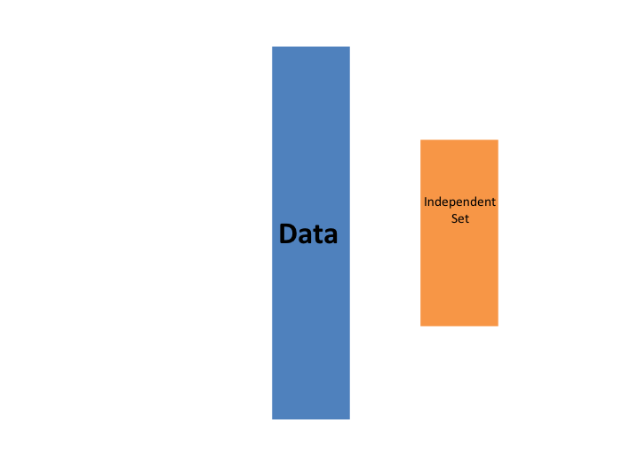
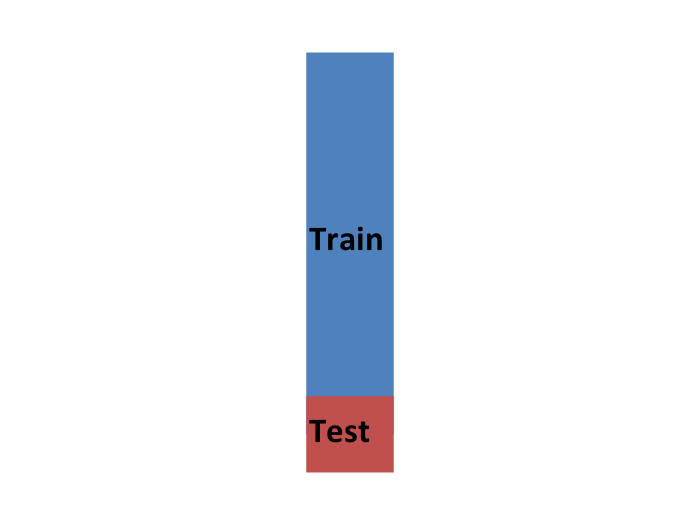
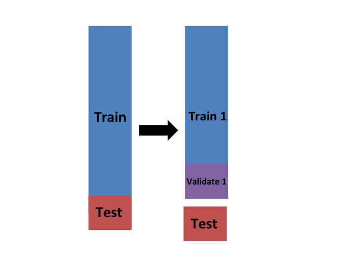
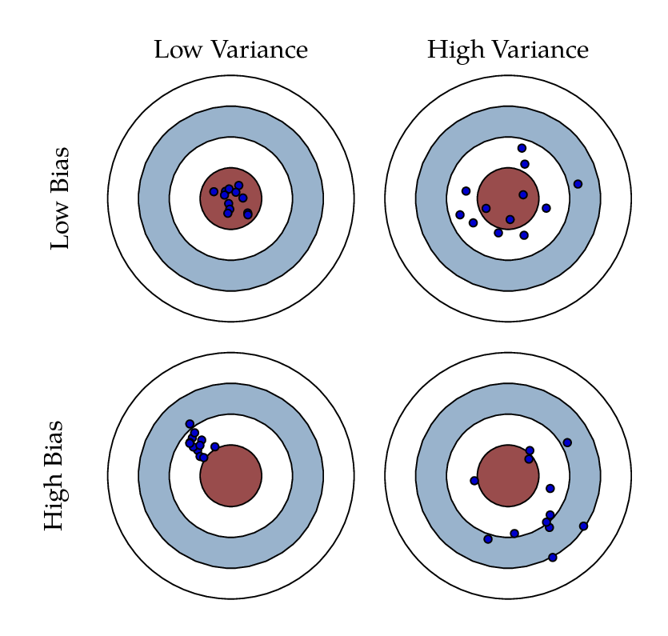
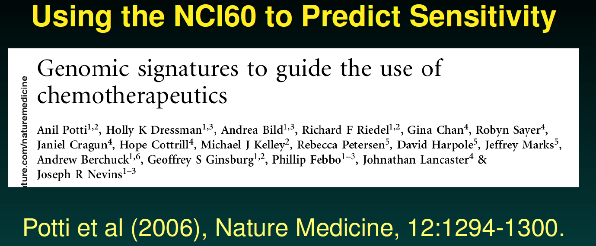
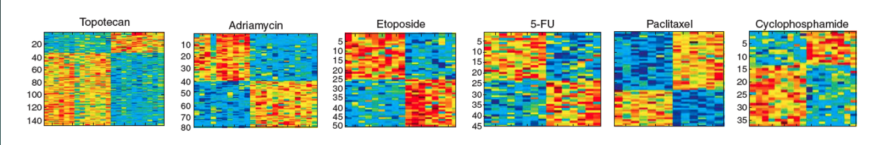
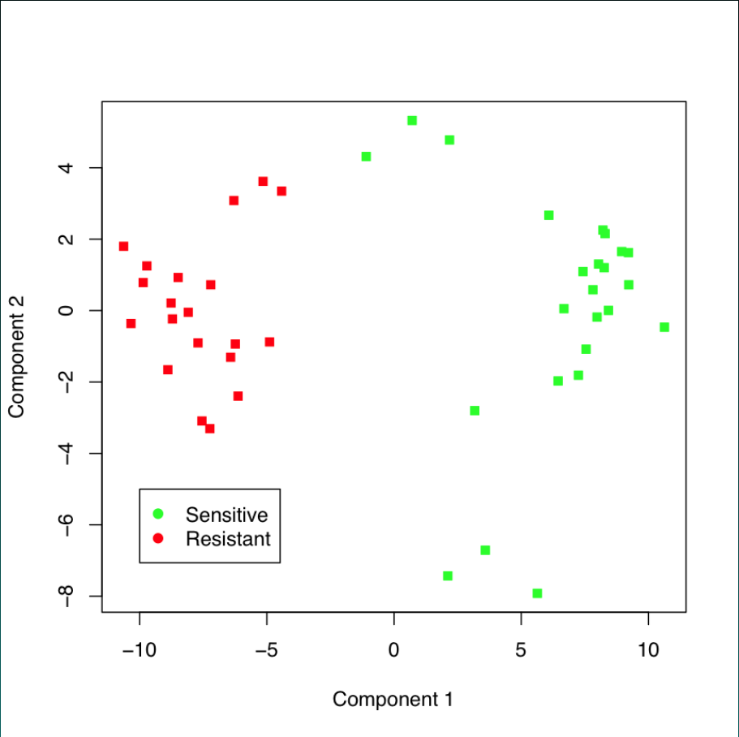
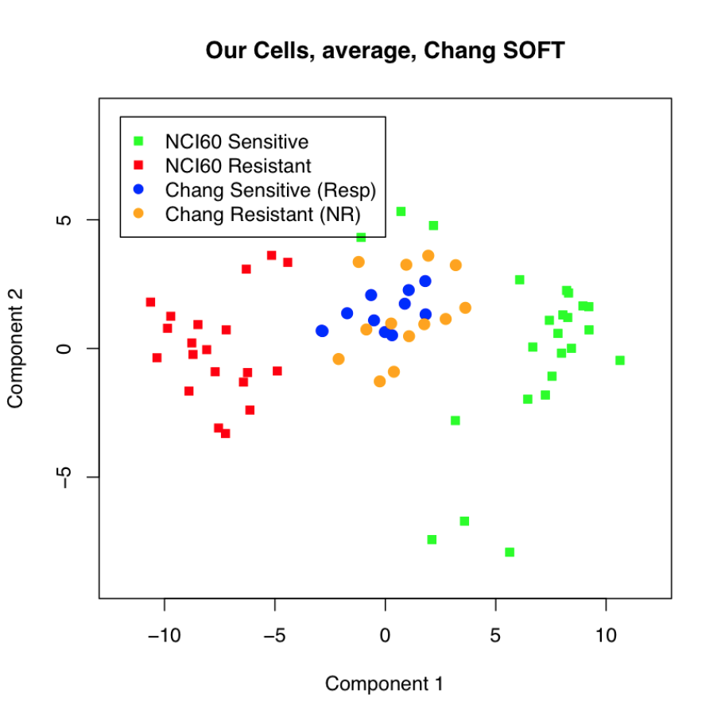
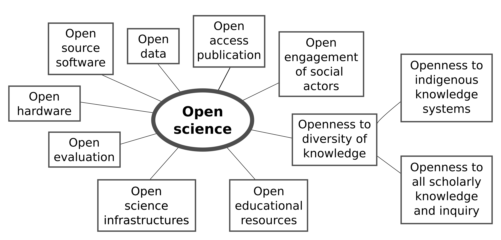

```{r setup, include=FALSE}
knitr::opts_chunk$set(echo = TRUE, fig.align = "center")
library(tidyverse); library(caret); library(dslabs)
library(glmnet); library(gridExtra); library(pROC)
img_path <- "figs/"
```

# Evaluating a model
## Training and test sets

```{r, include=FALSE}
library(dslabs); library(caret); library(tidyverse)
data(heights)
y <- heights$sex; x <- heights$height
set.seed(2007)
test_index  <- createDataPartition(y, times = 1, p = 0.5, list = FALSE)
test_set    <- heights[test_index, ]
train_set   <- heights[-test_index, ]
cutoff <- seq(61, 70)
accuracy <- map_dbl(cutoff, function(k){
  y_hat <- ifelse(train_set$height > k, "Male", "Female") %>%
    factor(levels = levels(test_set$sex))
  mean(y_hat == train_set$sex)
})
best_cutoff <- cutoff[which.max(accuracy)]
y_hat <- ifelse(test_set$height > best_cutoff, "Male", "Female") %>%
  factor(levels = levels(test_set$sex))
```

\Large
A machine learning algorithm is evaluated on how it performs in the real world with completely new datasets. We typically split the data into two parts and act as if we don't know the outcome for one of these. We refer to the group for which we know the outcome, and use to develop the algorithm, as the __training__ set. We refer to the group for which we pretend we don't know the outcome as the __test__ set. 

## The confusion matrix
\Large
Generally speaking, overall accuracy can be a deceptive measure. We construct the _confusion matrix_. We can do this in R using the function `table`:

```{r}
table(predicted = y_hat, actual = test_set$sex)
```

## The confusion matrix
If we study this table closely, it reveals a problem. If we compute the accuracy separately for each sex, we get:

```{r}
test_set %>% 
  mutate(y_hat = y_hat) %>%
  group_by(sex) %>% 
  summarize(accuracy = mean(y_hat == sex))
```

## The confusion matrix
\Large
So when computing overall accuracy, the high percentage of mistakes made for females is outweighed by the gains in correct calls for men. **This can actually be a big problem in machine learning.** 


## Sensitivity and specificity 
\Large
We name the four entries of the __confusion matrix__:

```{r, echo=FALSE}
mat <- matrix(c("True positives (TP)", "False negatives (FN)", 
                "False positives (FP)", "True negatives (TN)"), 2, 2)
colnames(mat) <- c("Actually Positive", "Actually Negative")
rownames(mat) <- c("Predicted positive", "Predicted negative")
tmp <- as.data.frame(mat)
if(knitr::is_html_output()){
  knitr::kable(tmp, "html") %>%
    kableExtra::kable_styling(bootstrap_options = "striped", full_width = FALSE)
} else{
  knitr::kable(tmp, "latex", booktabs = TRUE) %>%
    kableExtra::kable_styling(font_size = 8)
}
```

## Sensitivity and specificity 
\Large
**Sensitivity** is typically quantified by $TP/(TP+FN)$, the proportion of actual positives (the first column = $TP+FN$) that are called positives ($TP$). This quantity is referred to as the __true positive rate__ (TPR) or __recall__. 

## Sensitivity and specificity 
\Large
**Specificity** is defined as $TN/(TN+FP)$ or the proportion of negatives (the second column = $FP+TN$) that are called negatives ($TN$). This quantity is also called the true negative rate (TNR). 

## Sensitivity and specificity 
\Large
he `caret` function `confusionMatrix` computes all these metrics for us once we define what category "positive" is. The function expects factors as input, and the first level is considered the positive outcome or $Y=1$. In our example, `Female` is the first level because it comes before `Male` alphabetically. If you type this into R you will see several metrics including accuracy, sensitivity, specificity, and PPV.

```{r}
cm <- confusionMatrix(data = y_hat, 
                      reference = test_set$sex)
```

# Cross-validation
## Over-training

```{r, include=FALSE}
knn_fit <- knn3(y ~ ., data = mnist_27$train, k = 5)
```

**Over-training** or **over-fitting** results in having higher accuracy in the train set compared to the test set:
\small
```{r}
y_hat_knn <- predict(knn_fit, mnist_27$train, type = "class")
confusionMatrix(y_hat_knn, mnist_27$train$y)$overall["Accuracy"]

y_hat_knn <- predict(knn_fit, mnist_27$test, type = "class")
confusionMatrix(y_hat_knn, mnist_27$test$y)$overall["Accuracy"]
```


## K-fold cross validation
\Large
The first one we describe is __K-fold cross validation__. A machine learning challenge starts with a dataset (blue). We need to use this to build an algorithm that will be used in an independent validation dataset (yellow).
\center
{height=50%}

## K-fold cross validation
\Large
We create a __training set__ (blue) and a __test set__ (red). We will train our algorithm exclusively on the training set and use the test set only for evaluation purposes.
\center
{height=50%}

<!--
## K-fold cross validation
\Large First, we simply pick $M=N/K$ observations at random and think of these as a random sample $y_1^b, \dots, y_M^b$, with $b=1$. We call this the validation set:

\center
{height=50%}

## The caret `train` functon 
\Large
The __caret__ package also provides a function that performs cross validation for us. Here we provide some examples showing how we use this incredibly helpful package. We will use the 2 or 7 example to illustrate:

```{r, message=FALSE, warning=FALSE}
library(tidyverse)
library(dslabs)
data("mnist_27")
```

# Bias and variance
## Bias-Variance tradeoff 

\Large
In statistics and machine learning, the **bias–variance tradeoff** is the property of a model that the variance of the parameter estimated across samples can be reduced by increasing the bias in the estimated parameters.

The **bias–variance dilemma** or **bias–variance problem** is the conflict in trying to simultaneously minimize these two sources of error that prevent supervised learning algorithms from generalizing beyond their training set

(Source: Wikipedia)

## Bias-Variance tradeoff 
\Large
The **bias** is an error from faulty assumptions or mispecification of the learning algorithm. High bias can cause an algorithm to miss the relevant relations between features and target outputs (underfitting).

The **variance** is an error from sensitivity to small fluctuations in the training set. High variance may result from an algorithm modeling the random noise in the training data (overfitting).


## Bias-Variance tradeoff
\center
{height=62%}

# Data leakage
## What is data leakage?

\Large
Information that would **not be available at prediction time** leaks into
model fitting. The performance estimate then measures something other than
generalization.*Anything computed using samples that are
supposed to be held out has leaked.*

## Where it hides

\Large

- **Preprocessing on everything** -- normalization, imputation, PCA, or
  **batch correction** fit on train and test together
- **Feature selection outside the loop** -- ranking genes on all samples,
  then cross-validating only the classifier
- **The outcome itself** -- a predictor that is a *consequence* of the
  outcome (drugs prescribed after diagnosis)
- **Groups** -- the same patient in both training and test
- **Site or batch** -- cases from one site, controls from another

## Two questions, and a tell

\Large

1. Would I have this variable, in this form, at the moment of prediction?
2. Did any step see a sample it was not supposed to see?

\vskip .3in
\center
\Large
And the tell: on a hard clinical problem,\
a held-out AUC of 0.99 is a bug report.

## What leakage buys you

Randomize the TB outcome so there is **nothing to find**, add noise genes so
$p \gg n$, then select the top 10 genes and cross-validate:

\vskip .2in
\Large
\begin{center}
\begin{tabular}{lc}
\hline
 & AUC \\
\hline
Genes chosen on all samples (leaky) & $\approx 0.80$ \\
Genes chosen inside each fold (honest) & $\approx 0.50$ \\
\hline
\end{tabular}
\end{center}

\vskip .2in
\normalsize
A signature manufactured entirely out of noise. The code is in
`workshop_3` -- run it yourself.

## The fix

\vskip .2in
\Large
Every data-dependent step goes **inside** the resampling loop.

\vskip .2in
\large

- `preProcess` within `caret::train()`
- `recipes` in tidymodels
- `Pipeline` in scikit-learn
- Nested cross-validation when you are also tuning

\vskip .25in
\normalsize
If a step touches the data, it belongs in the loop -- the rule is the same
in either language.

# Reproducibility
## Some terminology

\Large

- **Reproducible**: a result can be recreated by others using the same
  data and the same analysis pipeline

\vskip .2in

- **Replicable**: the same scientific conclusion is reached using
  independent data and (maybe) an independent pipeline

\vskip .3in
\center
$\Rightarrow$ The reproducibility crisis is a *replication* crisis

## Reproducibility Crisis
\center
```{r, echo=FALSE, out.width="90%"}
knitr::include_graphics(file.path(img_path, "socialscience.png"))
```

## Reproducibility Crisis
\center
```{r, echo=FALSE, out.width="80%"}
knitr::include_graphics(file.path(img_path, "oscreproduce.png"))
```

## Non-Reproducible Science
\center
```{r, echo=FALSE, out.width="100%"}
knitr::include_graphics(file.path(img_path, "drugs.png"))
```

## A cautionary tale: genomic signatures for cancer
\center
{width="80%"}

\footnotesize
(Credit: Keith Baggerly and Kevin Coombes)

## A cautionary tale: genomic signatures for cancer

The claim: microarray data from cell lines (the NCI60) can define drug
response "signatures" that predict whether patients will respond.

Examples were given for 7 commonly used agents.

\center
{width="95%"}

\raggedright
This got the research community very excited -- and moved into clinical
trials.

## A cautionary tale: genomic signatures for cancer

We want the test data to look like this:
\center
{height=58%}

## A cautionary tale: genomic signatures for cancer

But instead it looked like this:
\center
{height=58%}

## A cautionary tale: genomic signatures for cancer
\center
```{r, echo=FALSE, out.width="62%"}
knitr::include_graphics(file.path(img_path, "retracted2.png"))
```

## A cautionary tale: genomic signatures for cancer
\center
```{r, echo=FALSE, out.width="68%"}
knitr::include_graphics(file.path(img_path, "retracted3.png"))
```

\raggedright
\small
Baggerly \& Coombes did the forensic work that unwound it.

## Real-life consequences
\center
```{r, echo=FALSE, out.width="88%"}
knitr::include_graphics(file.path(img_path, "retraction.png"))
```

## Leakage is a leading cause

\Large
Kapoor \& Narayanan (*Patterns*, 2023) surveyed 294 papers across 17
fields and found data leakage to be a leading driver of machine
learning results that fail to replicate.

\vskip .3in
\center
\Huge
The two problems are one problem.

## Why bother?
\center
```{r, echo=FALSE, out.width="100%"}
knitr::include_graphics(file.path(img_path, "selfishreproduce.png"))
```

\raggedright
\small
1. Reproducibility helps to avoid disaster
2. Reproducibility makes it easier to write papers
3. Reproducibility helps reviewers see it your way
4. Reproducibility enables continuity of your work
5. Reproducibility helps to build your reputation

## Some cool tools for reproducible science

\large

- **RMarkdown** / **Jupyter Notebooks**: dynamic documents that combine
  code, visualizations, narrative text, and output in one reproducible
  report.

- **GitHub**: version control and collaboration for code, documents,
  and workflows.

- **Nextflow** / **Snakemake**: workflow management for scalable,
  portable, multi-step pipelines.

- **Docker** / **Singularity**: containerization for consistent
  computational environments, so your code runs anywhere.

- **R/Shiny**: interactive applications and dashboards for data
  exploration.

## Open Science
\center
{width="72%"}

\small
(Open science elements based on UNESCO presentation of 17 February 2021)

## Open Science Practices (Johnson Lab)
\center
{width="62%"}

## Hands-on practice

\Large
Everything in this session has a matching workshop you can work through at your own pace:

\vskip .1in
\large

**`workshop_3`**

- Data partitioning and `trainControl`
- ROC curves and AUC across six algorithms
- Regularization with `glmnet`: LASSO, ridge, elastic net

\vskip .2in
\normalsize
All workshops are in the course repository, with the R Markdown source and a rendered HTML version.

## Session Info
\tiny
```{r session info}
sessionInfo()
```
