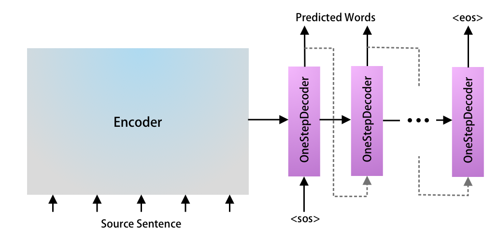
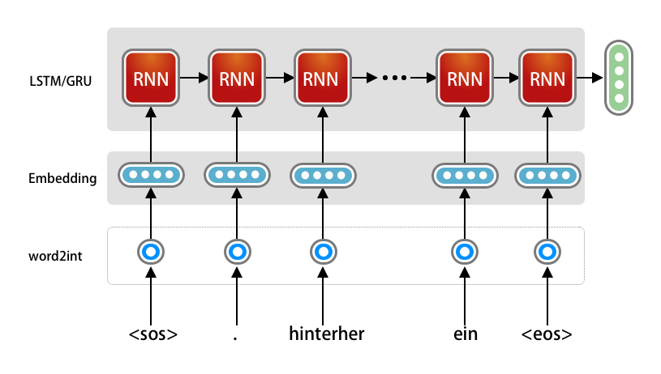
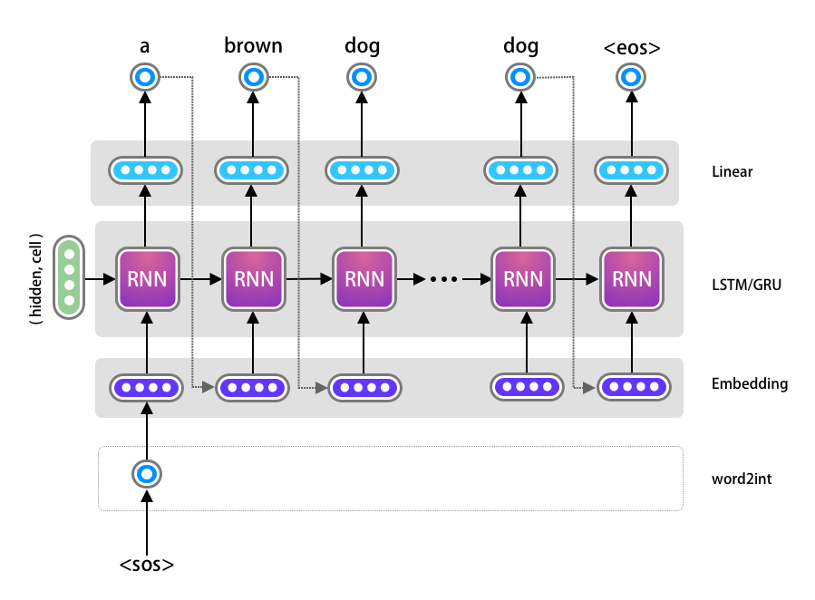

```{r, include=F}
library(knitr)
opts_chunk$set(echo = TRUE, out.width = "50%", fig.align = "center")
img_path <- "figs/"
```

# How it works

## Recurrent Neural Networks
\Large
- A type of neural network for **sequential data**
- Maintains **memory of previous inputs** using hidden states
- Commonly used for:
  - Natural Language Processing (NLP)
  - Time Series Forecasting
  - Speech Recognition

## Why Not Feedforward Networks?
\Large
- Standard neural networks assume **independent inputs**
- But sequences (like text) have **temporal dependencies**
- Example:
  - Sentence: *"The cat sat on the ___."*
  - You need previous words to predict the blank

## RNN Architecture
\Large
- Loops over time: same weights applied at each time step
- Input at time \( t \): \( x_t \)
- Hidden state: \( h_t = f(W x_t + U h_{t-1} + b) \)
- Output: \( y_t = g(V h_t + c) \)


## Diagram of RNN (Unrolled)
\center


## Challenges of RNNs
\Large
- Vanishing/exploding gradients during training
- Hard to learn long-term dependencies
- Solutions:
    - LSTM (Long Short-Term Memory)
    - GRU (Gated Recurrent Unit)

## RNN for Language Translation


## RNN for Language Translation
\center


## RNN for Language Translation
\center
{width=80%}

## RNN for Language Translation
\center
{width=80%}

## From RNNs to Transformers

\Large

- RNNs process sequences **one step at a time** -- slow, and long-range
  context decays
- Transformers process the **entire sequence at once**
- Introduced in *"Attention is All You Need"* (Vaswani et al., 2017)

## Key Idea: Attention

\Large

- Attention lets the model **focus on the relevant parts** of the input
- Computes attention scores between all pairs of tokens
- Every position can look at every other position, directly

## Self-Attention (Scaled Dot Product)

\vskip .3in
$$\text{Attention}(Q, K, V) = \text{softmax}\left(\frac{QK^T}{\sqrt{d_k}}\right) V$$

\vskip .3in
\Large
Queries, Keys, and Values are all learned projections of the same
sequence. The softmax turns "how relevant is each token to this one"
into weights.

## Multi-Head Attention
\Large
- Multiple attention “heads” allow the model to learn different relationships
- Outputs from each head are concatenated and linearly transformed

## Positional Encoding
\Large
- Transformers have no recurrence or convolution
- Positional encoding injects **order information** into the input embeddings
- Common method: use sine/cosine functions of different frequencies

## Transformer Architecture
\center
{height=70%}

## Why this mattered

\Large

- **Parallel**: the whole sequence at once, so training scales with
  hardware
- **Long-range**: no decay over distance
- **General**: the same architecture handles text, images, and
  biological sequences

\vskip .2in
\normalsize
Scale then did the rest. The architecture did not need to change much.

## What an LLM actually does

\Large
It predicts the next token.

\vskip .2in
\normalsize
Everything else -- summarizing, translating, answering, writing code --
is that one operation, conditioned on enough context and trained at
enough scale that the behavior becomes useful.

\vskip .2in
This is worth remembering when you are deciding whether to trust an
output.

# From prediction to agency

## A shift in what we ask AI to do

\Large

**Predictive AI** -- *Forecast and classify.* Maps inputs to outputs.
"Based on the past, what is likely to happen next?"

\vskip .15in

**Generative AI** -- *Create.* Learns a distribution and samples from
it. "Can you produce something new that looks like what you've seen?"

\vskip .15in

**Agentic AI** -- *Act.* Plans, uses tools, and works toward a goal.
"Here is the objective -- figure out how to get there."

## Powering Generative AI

\Large

**Large Language Models**: built on the transformer, using
self-attention to predict the next token. Strong at context,
summarization, and translation.

\vskip .2in

**Diffusion Models**: generate images by gradually removing noise from
a random signal. The engine behind text-to-image tools.

## Comparative Analysis

\small

| Feature | Predictive AI | Generative AI | Agentic AI |
| :--- | :--- | :--- | :--- |
| Primary goal | Forecast accuracy \& classification | Content creation | Task completion |
| Interaction | Input $\rightarrow$ class/value | Prompt $\rightarrow$ response | Goal $\rightarrow$ workflow |
| Output | Numbers, labels, probabilities | Text, images, code | Completed tasks, API calls, file edits |
| Reasoning | Statistical correlations | Pattern matching \& probability | Planning, reflection, tool selection |

## The Architecture of Agency

\Large

**Perception**: the agent gathers information -- reads a file, queries a
database, receives a prompt.

\vskip .15in

**Reasoning**: usually an LLM. Breaks the goal into a plan, decides
which tool to use, reflects on what came back.

\vskip .15in

**Action**: the execution layer -- APIs, code interpreters, queries.

\vskip .2in
\normalsize
The loop repeats until the goal is met or the agent asks for help.

## Agentic AI
```{r, echo=F}
knitr::include_graphics(paste0(img_path, "autonomous_agent.png"))
```

# Biomedical applications

## Where these tools actually earn their place

\Large

- **Unstructured text at scale** -- notes, reports, the literature
- **Code you would otherwise write by hand**
- **Structuring the unstructured** -- extraction into analyzable tables
- **Multi-step workflows** with a human at the decision points

\vskip .2in
\normalsize
Note what is *not* on this list: deciding what is true.

## Literature and evidence synthesis

\Large

- Screening abstracts against inclusion criteria
- Extracting study characteristics into a structured table
- Drafting a first-pass summary of a body of work

\vskip .2in
\normalsize
The gain is triage speed. The requirement is that every extracted value
stays traceable to its source -- which means the output is a table with
citations, not a paragraph.

## Extraction from clinical text

\Large

- Pulling stated findings out of radiology and pathology reports
- Normalizing free-text fields to a shared data dictionary
- Flagging records that need human review

\vskip .2in
\normalsize
This is where a federated setting helps: the text never leaves the
site, and only the structured result is shared.

## Code generation for analysis

\Large
An LLM can turn an analysis request into R or Python that runs against
a known data dictionary.

\vskip .2in
\normalsize
This is the use with the clearest payoff and the clearest danger. The
code is plausible whether or not it is correct, so it needs the same
validation you would demand of a collaborator's script -- read it, test
it, check the result against something you already know.

## An agentic framework for federated analysis

\Large
From our RePORT International work:

\vskip .1in
\large

- Investigator states the research question
- The agent proposes cohort, eligibility, exposure, outcome
- It generates metadata-aware code
- Code executes **inside the site's environment** -- no data moves
- Results return for review

## Human review at key decision points

\vskip .2in
\Large
The agent automates routine execution.

\vskip .2in
The investigator retains every scientific choice.

\vskip .3in
\normalsize
This is the design principle that makes the rest defensible. Automating
the typing is not the same as automating the judgment.

# Limits

## What these models are bad at

\Large

- **Confident error.** Fluency is not accuracy, and the two look
  identical on the page.
- **Provenance.** A generated citation may not exist.
- **Arithmetic and counting**, unless a tool does it.
- **Knowing what it does not know.**

## The reproducibility problem returns

\Large
An LLM will happily write you an analysis with the feature selection
outside the cross-validation loop.

\vskip .2in
\normalsize
It has read a great deal of published code, and a great deal of
published code leaks. Everything from the evaluation session applies
here -- with less visibility, because you did not write it.

\vskip .2in
\center
\Large
Generated code is a draft, not a result.

## A working rule

\vskip .3in
\Huge
\center
Use it where verification is cheap.\
Be careful where it is not.

## Questions \& Discussion

\Large
Thank you for your attention.

## Hands-on practice

\Large
Everything in this session has a matching workshop you can work through at your own pace:

\vskip .1in
\large

**`workshop_capstone`**

- An end-to-end analysis of RePORT India TB data
- Elastic net, SVM, and random forest compared on the same problem

\vskip .2in
\normalsize
All workshops are in the course repository, with the R Markdown source and a rendered HTML version.

## Session Info
\tiny
```{r session}
sessionInfo()
```
